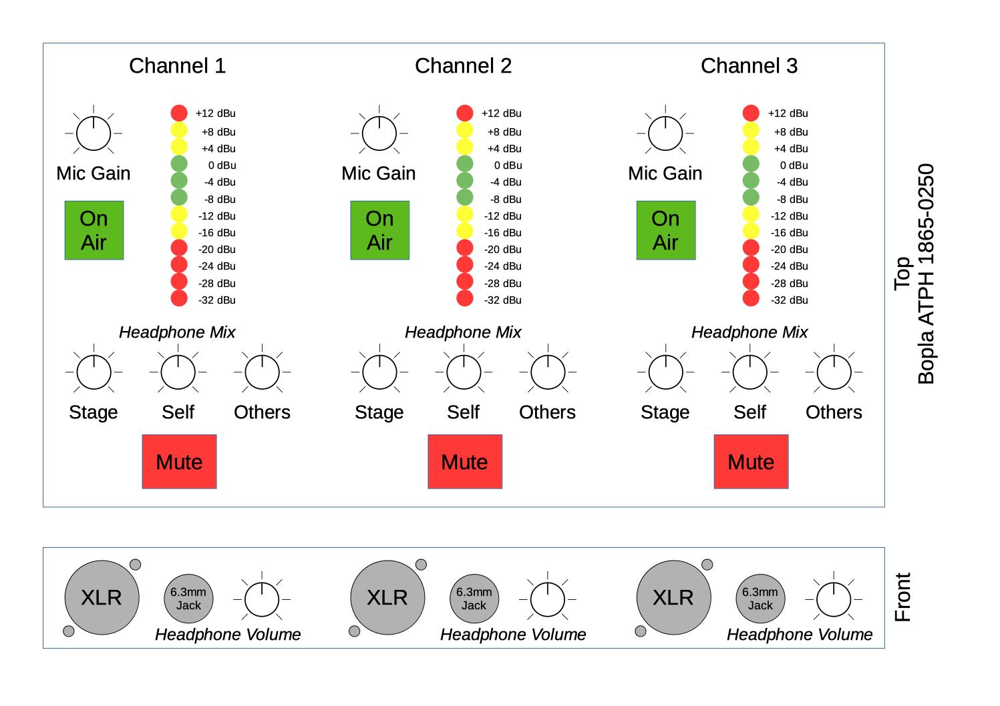

# Conference Interpreter Unit
[c3lingo.org](https://c3lingo.org) is doing the great job of translating many talks of the Chaos Communication Congress and other CCC-related events to multiple languages.
But the required hardware for simultaneous translation is quite expensive to rent, even if it's "just" a specialized analog audio mixer.

So the idea was born to design an easy to use hardware with the special requirements of our interpreters in mind.

## Requirements
The hardware unit should deliver the native audio (stage/ hall mix) to the interpreter's headset and provide a sum of all interpreter's microphone to the input of the video streaming/ recording chain.
Mixing of the final translated audio (ducking the native audio with the translation) will be done as part of the streaming/ recording chain, so the interpreter unit should just provide the sum of all microphones.

Normally just 2 interpreters will provide one translation, but demanding talks might require 3 people.
So either 3 headphone inputs/ outputs should be provided or it must be possible to daisy-chain multiple units.

The user interface of the unit should be as simple, as possible to decrease the risk of mis-configuration.
This means, that no compressor and equalizer will be added in the input group.

General requirements:
- Line input of stage/ hall mix (native language) (XLR/ 6.3 mm balanced jack combo connector)
- 3x Microphone input (XLR) (at first just dynamic microphones)
    * VU-Meter for each input channel. (Perhaps with special color scheme: too quiet, good, too loud, clipping)
    * Fader/ Potentiometer for gain control
    * On-Air switch (on/ off position, with state LED)
    * Temporary mute button (momentary switch)
- 3x Headphone output (6.3 mm mono/ stereo (2x mono) jack)
    * Should output mix of native audio, own microphone and other translator's microphone
    * Potentiometer for output volume
    * Potentiometer for volume of own microphone in the mix
    * Potentiometer for volume of other two microphones in the mix
- Outputs:
    * Sum of all translators (XLR/ 6.3 mm balanced jack combo connector)

All inputs (besides the microphones) and outputs should:
- expect/ deliver a nominal level of +6dBu (german TV broadcast standard, 0 dBu = 0,775 Veff)
- be transformer balanced and galvanically isolated

This results in a signal flow like this: 

## Status

### Tasks
- [x] Requirements collection
- [x] Electrical design draft/ proof of concept (breadboard)
- [x] Proof of concept validation
- [x] First PCB layout (prototyping modules)
- [x] More testing/ validation
- [ ] Second PCB layout + casing prototype
- [ ] More testing/ validation

Help is always appreciated!

### Implemented Requirements
- [x] Microphone input
- [x] Line input
- [x] Microphone summing and line output driver
- [x] Adjustable headphone mix and output volume
- [ ] ESD protection and galvanic isolation of line inputs and outputs
- [x] VU meter (own PCB)
- [x] VU meter (integrated in front panel PCB)
- [x] Mute and On-Air buttons

## Electrical Design
This chapter contains some notes on the electrical design.
Currently just the sources of the used circuit designs.

### Microphone Input
#### Preamplifier
For the microphone preamp, we are using the NE5534 low-noise opamp with a circuit design from [circuitlib microphone pre-amp](https://www.circuitlib.com/index.php/schematics/product/29-balanced-microphone-preamplifier).

#### Controllable Amplification
In a normal mixer, you would be able to lower the microphone's volume to zero.
But in our case we just need on/ off and some gain range to adjust for different microphones and loudness of different people.

TODO: Integrate the On-Air button with it's LEDs

### Line Input/ Input Module
The line input must not be amplified at all, because loudness control of the headphones is done by the headphone amplifier section.
But the differential line-level signal must be converted to a single-ended signal by the input stage.

The current design uses a LM833N opamp to convert the balanced signal into a single ended signal and has a second LM833N to provide some degree (+- 6 dB) of "factory" adjustment.
The second part of that circuit was taken from the [circuitlib audio mixer tutorial](https://www.circuitlib.com/index.php/tutorials/product/39-how-to-build-an-audio-mixer).

TODO: How to achieve galvanic isolation?

### Summing
Summing is needed in two places: Creating the sum of all microphones (not adjustable, fixed output gain) and for the headphone mix (one input level adjustable).
A simple summing circuit using one operational amplifier is enough for our application, like in [circuitlib audio mixer tutorial](https://www.circuitlib.com/index.php/tutorials/product/39-how-to-build-an-audio-mixer).

The mixer design uses inverting op-amp circuits, because they require less components and signal routing.
Normally an audio mixer should take care of adding signals in-phase, because otherwise two microphones might cancel each other out.
In our case, there are just two types of summing: All microphones for the interpreter unit's line-out and the individual headphone mixes.
Because the stage input is quite independent of the interpreter's microphones, no special phase/ inversion considerations are needed.
And the microphones connected to our unit will experience the same inversions anyways.

### Line Output Driver
Line Output conversion is done by the [DRV134](https://www.ti.com/product/DRV134) IC.

TODO: How to achieve galvanic isolation?

### Headphone Output Driver
The headphone output needs a maximum output power of about 0.1 W and should put the mono signal on both stereo channels of the TRS jack.

For the first draft, we're using one LM386 audio power amplifier even though it has a quite high minimal amplification of factor 20.

### VU Meter
When searching for VU meter circuits, many use the LM3916 LED bar graph driver, which already has the right scaling built in.
But this chip is obsolete and not produced any more, so we designed our own chain of comperators to drive a set of LEDs.

## User Interface
The user interface should enable the interpreters to adjust their microphone gain and headphone mix on their own.
Additionally, a (permanent) on/off switch, as well as a (temporary) mute button should be present.

A possible UI layout might look like this: 

### Potentiometers
We need some single and dual channel logarithmic scale potentiometers, which are matching in size, for:
- top plate interface (all vertical style, threaded collar would be nice):
    * 1 single channel for the input gain (resistance doesn't matter)
    * 2 single and 1 stereo channel for the headphone mix (ideally 50K, b/c 3 will be in parallel)
- front plate next to the headset jacks (horizontal style, threaded collar not needed):
    * 1 single channel for the headphone volume (ideally 50K, b/c that's already tested)

Possible knobs may be:
- (A) Re'an F311/ F313 series (11/ 13 mm diameter) -- 0.40 €/ 0.55 €:  
    Boring: 9.0 mm D-style hole + 0.0 mm nut cover section = 9.0 mm
- (B) Re'an P670 series (12 mm diameter/ 16 mm at bottom) (alt. Davies Molding 1101) -- 0.78 €:  
    Boring: 7.5 mm D-style hole + 4.5 mm nut cover section = 12.0 mm  
    Nut cover: 12.9 mm diameter (M7 nut is 12.5 mm corner to corner)
- (C) Re'an P300 series (11 mm diameter/ 15 mm at bottom):  
    Boring: 9.0 mm D-style hole + 3.0 mm nut cover section = 12.0 mm  
    Nut cover: ? mm diameter (M7 nut is 12.5 mm corner to corner)
- ~~(D) Cliff K87MAR series/ RS Pro 777-73xx: 7.5 mm hole depth + 4.5 mm skirt = 12 mm, inner size of skirt 12 mm (measured)~~  
~~Notes: D-style boring has wrong size (5 mm instead of 4.5 mm flatted)~~

Potentiometers from Alps Alpine seem to have a decent quality in a small package size and quite affordable price.
From their lineup, the RK09K/D, RK11/12/14, RK09L and RK097 series are left considering our requirements (mouser prices without VAT, shortlist marked bold):
- Alps Alpine Series RK09K/D (6 mm D-style (4.5 mm) shaft):
    * vertical (top plate):
        + **single channel: 10K, 15 mm -- RK09K1130AJ3 -- 0.91 €**  
            actual shaft length (dwg. 2): 7.4 mm (6 mm flattened)  
            _matching knobs: A_
        + dual channel: 10K, 15 mm -- RK09K12C0A19 -- 1.23 €  
            actual shaft length (dwg. 10): 7.4 mm (6 mm flattened)  
            _matching knobs: A_
        + **dual channel: 50K, 20 mm -- RK09K12C0A2S -- 1.44 €**  
            actual shaft length (dwg. 10): 12.4 mm (7 mm flattened)  
            _matching knobs: C, B (depending on front plate thickness)_
    * horizontal (front plate):
        * single channel: 10K, 15 mm -- RK09K1110A2S -- 0.67 €  
            actual shaft length (dwg. 1): 7.4 mm (6 mm flattened)  
            _matching knobs: A_
        * **single channel: 50K, 15 mm -- RK09K1110B1R -- 0.67 €**  
            actual shaft length (dwg. 6): 7.4 mm (6 mm flattened)  
            _matching knobs: A_
- Alps Alpine Series RK09L (6 mm D-style (4.5 mm) shaft, collar with M7 thread):  
    * vertical (top plate):
        + **single channel: 10K, 12.5 mm -- RK09L1140A5E -- 1.61 €**  
            actual shaft length (dwg. 2): 7.5 mm (7 mm flattened) + 5 mm thread length  
            _matching knobs: A_
        + **dual channel: 10K, 15 mm -- RK09L12D0A1W -- 1.64 €**  
            actual shaft length (dwg. 4): 10 mm (7 mm flattened) + 7 mm thread length  
            _matching knobs: C, B (depending on front plate thickness)_
        + dual channel: 10K, 20 mm -- RK09L12D0A1T -- 1.64 €  
            actual shaft length (dwg. 4): 15 mm (12 mm flattened) + 7 mm thread length  
            _matching knobs: Unknown, b/c of quite long shaft_
    * horizontal (front plate):
        + **single channel: 10K, 15 mm -- RK09L1120A2S -- 1.62 €**  
            actual shaft length (dwg. 1): 10 mm (7 mm flattened) + 5 mm thread length  
            _matching knobs: C, B (depending on front plate thickness)_
        + single channel: 10K, 20 mm -- RK09L1120A69 -- 1.30 €  
            actual shaft length (dwg. 1): 15 mm (12 mm flattened) + 7 mm thread length  
            _matching knobs: Unknown, b/c of quite long shaft_
        + dual channel: 50K, 15 mm -- RK09L12B0A31 -- 1.78 €  
            actual shaft length (dwg. 3): 10 mm (7 mm flattened) + 5 mm thread length  
            _matching knobs: C, B (depending on front plate thickness)_
- ~~Alps Alpine Series RK11K/12L/14K~~: no suitable options
- ~~Alps Alpine Series RK097 (6 mm D-style (4.5 mm) shaft, collar with M7 thread)~~: Only horizontal style and quite expensive (2.16 €/ 2.96 €)

**Selection**:
- Input gain:
    * RK09K1130AJ3 (single, 10K, 15 mm) + Re'an F311/ F313 (diameter TBD)
    * or RK09K12C0A2S (dual, 50K, 20 mm) + Re'an P670 or similar
- Headphone mix:
    * RK09K12C0A2S (dual, 50K, 20 mm) + Re'an P670
- Headphone volume:
    * RK09K1110B1R (single, 50K, 15 mm) + Re'an F311/ F313 (diameter TBD)

### Switches
The **On-Air** button needs to be a latching DPDT switch, ideally with LED illumination and max. 8 mm height (PCB to front plate), like:
- E-Switch TL2230EEF140, no illumination -- 0.60 €  
    DPDT, PCB mount  
    Height: 7.0 mm + 5.5 mm plunger (2x3 mm cap terminal)  
    Cap: see APEM models
- **APEM MHPS2273 (EU version: PHAP4673), no illumination, no audible click -- 0.41 €**  
    DPDT, PCB mount  
    Height: 7.0 mm + 5.5 mm plunger (2x3 mm cap terminal)  
    Cap: U542x (11.5 mm square, 4 mm height), **U453x (9.4 mm dia., 6.65 mm height) -- 0.64 €**  
    Cap color codes: **2 Black**, 4 Grey, 5 Yellow, 6 Red

The **mute** button needs to be a momentary SPST (normally open) or SPDT push button, like:
- E-Switch TL2230OAF140, no illumination -- 0.53 €  
    DPDT, PCB mount  
    Height: 7.0 mm + 5.5 mm plunger (2x3 mm cap terminal)  
    Cap: see APEM models
- **APEM 1413NC6/ 1415NC6 -- 3.72 €**  
    SPST/ SPDT, front plate snap-in mount, solder lugs  
    Button size: 12 mm square, Color: Red (color code 6)  
    Cap: U542x (11.5 mm square, 4 mm height), **U453x (9.4 mm dia., 6.65 mm height) -- 0.64 €**  
    Cap color codes: 2 Black, 4 Grey, 5 Yellow, 6 Red  
    Depth: 13 mm + 6 mm for contacts = 19 mm
- NKK Switches LP0115C{C,M}KW01-C -- 7.91 €  
    SPDT, front plate bushing/ snap-in mount, solder lugs  
    Button size: 13.6 mm dia., Color: Red (color code C)  
    Depth: 22 mm

### Casing
The casing should be a desk console (angled surface), ideally with space at the front to mount the headset ports (XLR and 6.3 mm jack), like:
- [Bopla ATPH 1865-0250](https://www.bopla.de/gehaeusetechnik/product/alu-topline/gehaeuse-18/atph-1865-0250.html) (front might not have enough space for the connectors)
- Design our own casing to laser cut/ 3D print

The electrical design consists of three identical channel strips, a line I/O board and a power supply.
Each channel strip is separated in two boards, one for the top plate with the VU meter and main controls and one for the front panel with the headset jacks and headphone volume knob.

The distance between top plate and PCB is 7 mm (determined by the potentiometers and on-air switch), which should also be suitable for standard 5 mm LEDs.
Connectors and larger components will be mounted on the back side, so enough space behind the PCB is needed.
The top plate should not exceed 2 mm thickness because of the potentiometer knobs, 1 to 1.5 mm would be ideal.

The I/O boards (headphone and line signals) will just have components on the top side and might be steady enough by the XLR and 6.3 mm jack connectors.
The plate thickness should not exceed 2.5 mm.

## Notes
A dynamic microphone needs at least 50-60 dB gain in the pre-amp, because a typical signal is at about 1 - 100 uV (-118 to -78 dBu or -120 to -80 dBV).

Line level in professional audio gear is at +4 dBu, which is 1.228 V (RMS).
Because 0 dBu is defined as 1 mW at a load of 600 Ohm, which needs a voltage of 0.77 V.
Increasing the voltage by a factor of 10 is an amplification of 20 dB.

## BoM
Approximate prices in Euro.

Connectors and Buttons (User Interface)

| Count | Manufacturer + Art. No.  | Description                      | €/ pc.|
|-------|--------------------------|----------------------------------|-------|
| 1     | Neutrik NAC3 MPA-1       | Mains Power Input                | 3.33  |
| 1     | Neutrik NCJ6FA-H         | Line Input                       | 1.27  |
| 1     | Neutrik NC3MAAH          | Line Output                      | 0.92  |
| 3x1   | Neutrik NC3FAAV2         | Headset Microphone Input         | 1.10  |
| 3x1   | Rean NYS 216 G           | Headphone Output                 | 0.93  |
| 3x1   | APEM 1415NC6             | Mute Button (red cap, snap-in)   | 3.72  |
| 3x1   | APEM MHPS2273            | On-Air Button                    | 0.41  |
| 3x1   | APEM U4532               | On-Air Button black cap          | 0.64  |
| 3x1   | Alps RK09K1130AJ3        | 10K log Mono Pot. (Gain)         | 0.91  |
| 3x1   | Re'an F311               | Potentiometer Knob               | 0.40  |
| 3x3   | Alps RK09K12C0A2S        | 50K log Dual Pot. (Headset Mix)  | 1.44  |
| 3x3   | Re'an P670               | Potentiometer Knob               | 0.78  |
| 3x1   | Alps RK09K1110B1R        | 50K log Mono Pot. (Headset Vol.) | 0.67  |
| 3x1   | Re'an F311               | Potentiometer Knob               | 0.40  |
| 1     | Vishay M64{Y,Z}104       | 100K Trim Pot.                   | 0.95  |
|       |                          | **SUM**                          | 53.99 |

Sub-Components

| Count | Manufacturer + Art. No.  | Description                      | €/ pc.|
|-------|--------------------------|----------------------------------|-------|
| 1     | Traco Power TXL 035-1515D or TOP 60533 | Power Supply       | ~48.00 |

PCB Components: TODO when schematic is finished

| Count | Manufacturer + Art. No.  | Description                      | €/ pc.|
|-------|--------------------------|----------------------------------|-------|
| 3     | NE5534                   | Low-noise Op-Amp                 | 0.54  |
| 8     | LM833                    | Generic Op-Amp                   | 0.88  |
| 3     | LM386N-4                 | Audio Power Amp                  | 0.83  |
| 1     | DRV143                   | Line Driver                      | 4.50  |
| TODO  | TODO                     | El. Capacitor                    | TODO  |
| TODO  | TODO                     | Cer. Capacitor                   | TODO  |
| TODO  | TODO                     | Resistor                         | TODO  |
|       |                          | **SUM**                          | TODO  |

VU Meter Components

| Count | Art. No.            | Description         | €/ pc.|
|-------|---------------------|---------------------|-------|
| 1     | Vishay M64{Y,Z}503  | 50K Trim Pot.       | 0.95  |
| 1     | LM833               | Generic Op-Amp      | 0.88  |
| 2     | 1N4148              | Signal Diode        | 0.02  |
| 1     | 1k Metal Film       | Resistor            | TODO  |
| 1     | 3.9k Metal Film     | Resistor            | TODO  |
| 1     | 47 uF               | El. Capacitor       | TODO  |
| 1     | 100k Metal Film     | Resistor            | TODO  |
| 3     | LM339               | Quad-Ch. Comperator | 0.29  |
| 5     | 100 nF              | Cer. Capacitor      | TODO  |
| 1     | 1 uF                | El. Capacitor       | TODO  |
| 5     | Vishay TLHR 5404    | LED red             | 0.18  |
| 4     | Vishay TLHY 5404    | LED yellow          | 0.14  |
| 3     | Vishay TLHG 5404    | LED green           | 0.17  |
| 12    | 390R                | Resistor            | TODO  |
| 1     | 39R                 | Resistor            | TODO  |
| 2     | 68R                 | Resistor            | TODO  |
| 1     | 100R                | Resistor            | TODO  |
| 1     | 150R                | Resistor            | TODO  |
| 1     | 270R                | Resistor            | TODO  |
| 1     | 390R                | Resistor            | TODO  |
| 1     | 680R                | Resistor            | TODO  |
| 1     | 1K                  | Resistor            | TODO  |
| 1     | 1.5K                | Resistor            | TODO  |
| 2     | 2.7K                | Resistor            | TODO  |
| 1     | 3.9K                | Resistor            | TODO  |
|       |                     | **SUM**             | TODO  |
